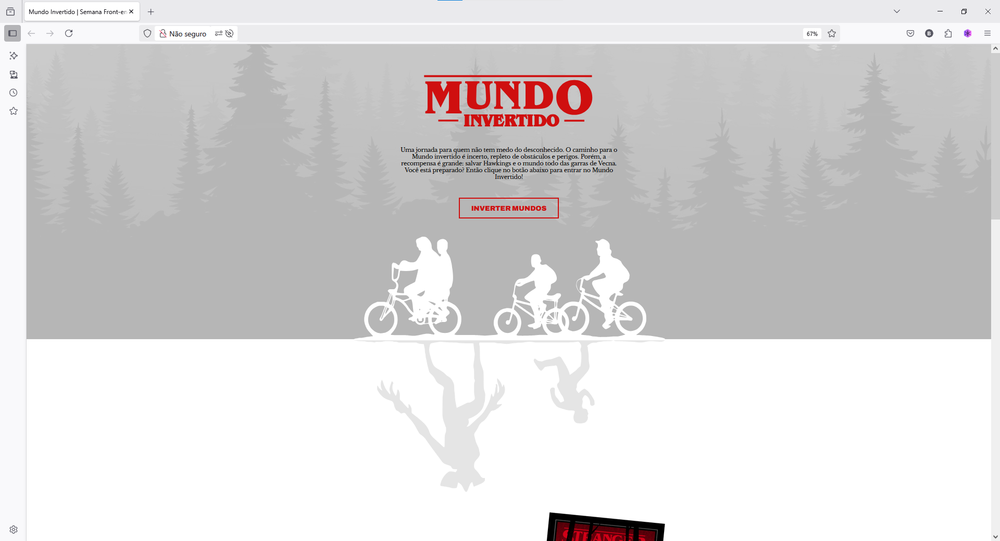

# 🌐 Deploy na AWS EC2 - Projeto Mundo Invertido

Este projeto faz parte do desafio prático da plataforma DIO e tem como objetivo realizar o deploy de um site estático fictício da série Stranger Things na AWS, utilizando uma instância EC2.

---

## 🎯 Objetivo

Aprender e praticar os seguintes tópicos:
- Criação de instância EC2 na AWS
- Acesso via SSH
- Instalação e configuração do Apache
- Deploy de arquivos estáticos (HTML/CSS)
- Abertura de portas de acesso (SG)

---

## 🚀 Resultado

O projeto foi implementado com sucesso!  
Confira prints da aplicação rodando na EC2:



---

## 💻 Comandos utilizados (EC2 Ubuntu)

```bash
sudo apt update
sudo apt install apache2 -y
sudo systemctl start apache2
sudo systemctl enable apache2
cd /var/www/html
sudo rm index.html
sudo nano index.html

---

## 👨‍💻 Autor

**Brendon Pereira Gomes**  
[LinkedIn](https://www.linkedin.com/in/brendon-pereira-gomes) | [GitHub](https://github.com/brendonp)

